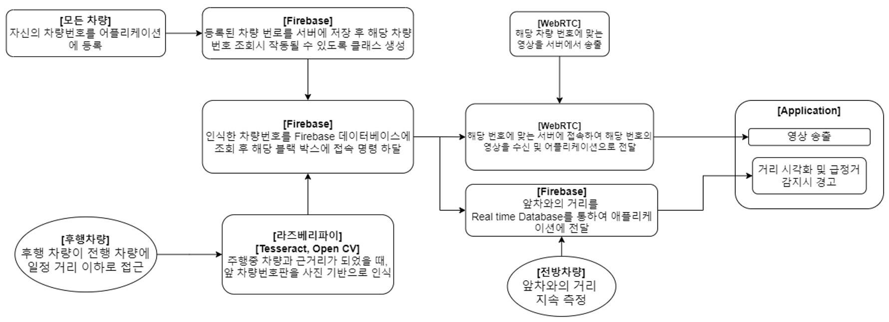

# 2024_ESW_whitebox \n( V2X 통신을 활용한 차량의 사각지대 예방 솔루션 )
<div align="center">
  
</div>

# 프로젝트 개요
사각지대는 운전자의 시야에서 보이지 않는 구역으로, 어린이 보호구역 등에서 심각한 사고를 유발할 수 있다. 이를 해결하기 위해 본 프로젝트는 기존의 블랙박스와 CCTV를 활용해 사고를 사전에 예방하는 '화이트박스' 솔루션을 제안한다. 운전자는 다른 차량의 블랙박스 화면을 실시간으로 공유 받아 시야를 넓히고, CCTV를 통해 보행자의 위치와 돌발 행동을 추적하여 경고를 받을 수 있다. 이 시스템은 고속도로 환경에서의 시야 확장과 어린이 보호구역에서의 사고를 방지하는 데 두가지 상황에 초점을 맞추고 있다.

# 프로젝트 구성

프로젝트는 크게 두가지의 프로세스(process1, process2)로 구분되며, 이를 통합하는 어플리케이션 (whitebox_app)으로 구성.

## 프로세스 설명

### Process 1 <앞차량의 블랙박스 데이터 공유>
- **Hardware.ino**: 차량을 구성하는 코드. 적외선 리모콘으로 차량을 움직이고, 앞차량과의 거리를 감지하여, 메인 컴퓨터인 라즈베리파이로 플래그를 전송하는 거리 감지 정보 플래그를 전송함.
  
- **plate_recognition.py**: tesseract-ocr 모듈을 이용해서, 앞차량의 번호판을 인식하며, 번호판 양식에 적합한 양식인지 확인하고 필터링 함.
  
- **send_plate_number_to_firebase.py**: 인식된 번호판 정보를 바탕으로 현재 차량이 감지하고 있는 번호판 정보를 Firebase Reatime base에 등록함.
  
- **plot_car_point.py**: RFID 센서를 통해 파악한 현재 차량의 위치를 Firebase Reatime base로 전송하는 코드.
  
- **WebRTC 시그널링 서버**: WebRTC 클라이언트 간에 SDP와 ICE 정보를 교환하여 P2P 연결을 설정하는 역할. 각 클라이언트를 세션에 연결하고, 필요한 메시지를 중계해 영상/오디오 전송을 위한 P2P 통신을 가능하게 한다.


<div align="center">
  
</div>


### Process 2 < Yolov5 + sort 를 이용한 보행자 트래킹 > 
- **main.py**: 최초 실행시, 차도 영역과 인도 영역을 설정한 이후, 커스텀 학습 데이터를 이용하여, 보행자를 트래킹하고 보행자의 예측 위치, 현재 위치 정보를 추적한다.
  
- **flag.py**: 보행자의 예측 위치, 현재 위치를 바탕으로 CCTV와 연결된 led를 점멸하는 하드웨어와의 통신을 설정하는 코드. UART 통신을 바탕으로 하드웨어를 제어한다.
  
- **objsort.py**: 물체를 트래킹 하는 SORT의 핵심 모듈. 칼만 필터와 IOU(Intersection over Union) 알고리즘을 이용해서, 다수의 객체를 트래킹하고, 가장 유사한 객체끼리 연결하는 방식.


<div align="center">
  
</div>

## 어플리케이션 설명

### Whitebox App

#### 1. P2P 연결을 통한 블랙박스 데이터 스트리밍
  1. Firebase Realtime Database를 통해 블랙박스에서 감지한 **앞차량의 번호판 데이터**를 수신한다.
  2. 해당 번호판을 기반으로 차량과 **P2P 방식**으로 연결을 설정한다.
  3. 연결된 차량의 블랙박스 데이터를 **실시간으로 스트리밍**하여 앞차량의 블랙박스 영상을 확인할 수 있다.

#### 2. 차량 및 보행자 좌표 데이터 시각화
  1. Firebase Realtime Database를 통해 **현재 차량과 보행자의 좌표 데이터**를 수신한다.
  2. 이 데이터를 바탕으로 운전자에게 **시각화된 정보**를 제공하여 차량과 보행자 간의 거리를 실시간으로 파악할 수 있게 한다.
  3. 이를 통해 운전자는 **보행자와의 거리를 실시간으로 확인**하고, 안전한 주행을 할 수 있다.

## 디렉토리 구조

```bash
.
├── process1
│   ├── Hardware
│   │   └── Hardware.ino
│   ├── plate_recognition.py
│   ├── plot_car_point.py
│   ├── send_plate_number_to_firebase.py
│   └── WebRTC
│       ├── css
│       │   └── main.css
│       ├── index.html
│       ├── index.js
│       ├── js
│       │   └── main.js
│       ├── package.json
│       ├── package-lock.json
│       ├── private.pem
│       ├── public.pem
│       └── README.md
├── process2
│   ├── flag.py
│   ├── Hardware
│   │   └── Hardware.ino
│   ├── main.py
│   └── objsort.py
├── README.md
└── whitebox_app
    └── WhiteBox/app/src/main/java/io/antmedia/mywebrtcstreamingapp
        ├── MainActivity.java
        ├── PlateNumbersResponse.java
        ├── RegisterVehicleActivity.java
        ├── RetrofitClient.java
        ├── RetrofitService.java
        └── VehicleListActivity.java


```
# 작품 사진

<div align="center">
  
  
</div>

# 시연 영상

https://www.youtube.com/watch?v=ep7Klf0uMPo


